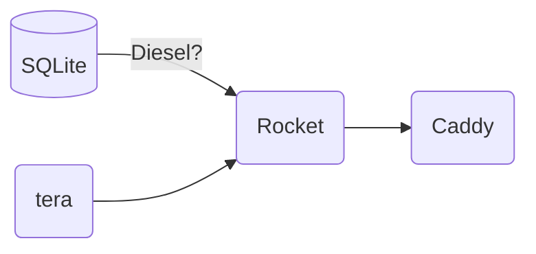

An event listing service for parties, protests, and any other forms of collective assembly you might not want to advertise on facebook.

Currently very much under production and not finished yet!

# Infrastructure



# Set up

(on Debian)

Install ~libsqlite3-dev~ this is just a cargo dependency.

To generate database migration

```sh
diesel migration generate --diff-schema create_events
```
